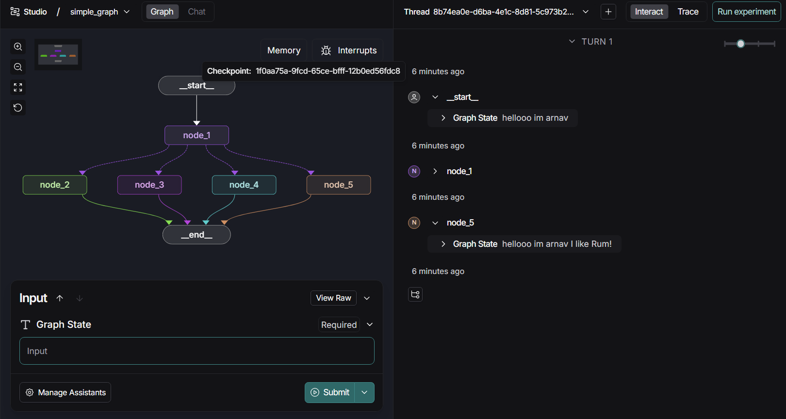
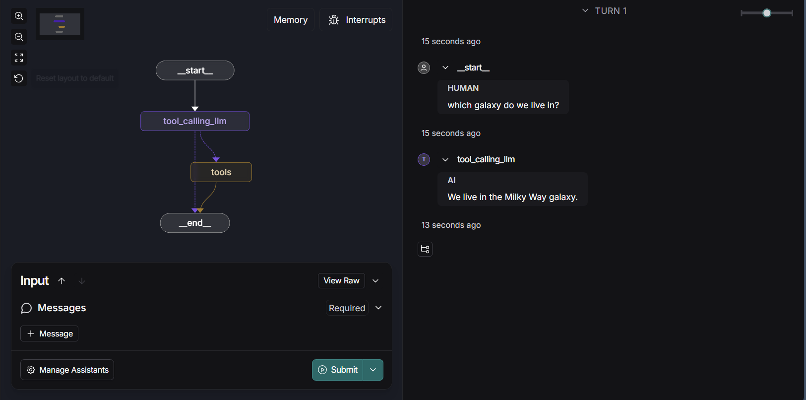
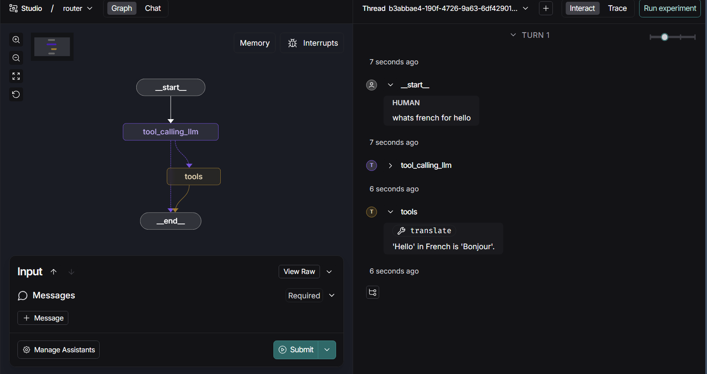

# Foundation: Introduction to LangGraph

---

## Module 0:

[arnavv06-langgraph-mat496/notebooks/module-0 at main · MAT496-Monsoon2025-SNU/arnavv06-langgraph-mat496](https://github.com/MAT496-Monsoon2025-SNU/arnavv06-langgraph-mat496/tree/main/notebooks/module-0)

There wasn't much to learn as everything had been covered before.

Set API keys and loaded the .env file. Also instantiated two models and used **.invoke()** and **.stream()** to pass HumanMessage as a string and get AIMessage as output.

*Changes made:*

Changed and added new prompts.

---

## Module 1:

[arnavv06-langgraph-mat496/notebooks/module-1 at main · MAT496-Monsoon2025-SNU/arnavv06-langgraph-mat496](https://github.com/MAT496-Monsoon2025-SNU/arnavv06-langgraph-mat496/tree/main/notebooks/module-1)

### Video 1: Motivation

Learned that **Chains** are fixed control flows set by the developer, and an A**gent** controls the flow defined by an LLM. As more control is given to the agent, the application's reliabilty decreases. **LangGraph** is used to increase this reliability.

*Changes made:*

There wasn't any code so no changes had to be made.

### Video 2: Simple Graph

[arnavv06-langgraph-mat496/notebooks/module-1/simple-graph.ipynb at main · MAT496-Monsoon2025-SNU/arnavv06-langgraph-mat496](https://github.com/MAT496-Monsoon2025-SNU/arnavv06-langgraph-mat496/blob/main/notebooks/module-1/simple-graph.ipynb)

Learned a very simple **graph** structure consisting of **nodes** and simple/conditional **branches**. Created one function to define "node" and one for "branch"

Learned how to create a graph using  **StateGraph()** which has a simple edge from Start to Node1, and **conditional edges** further ahead to decided which node to go to based on the parameters passed.

*Changes Made:*

* Created and added a couple of more **nodes** to the graph.
* Created more **conditional branches** and connected them in graph.
* Changed the branch function to decide which drink I like.

### Video 3: Langsmith Studio

Learned to visualise graphs as flowcharts using **Langsmith Studio**. Previosly it was being shown in jupyter notebook.

*Changes made:*

Edited **simple.py** file according to the graph I constructed in previous notebook.

### Video 4: Chain

[arnavv06-langgraph-mat496/notebooks/module-1/chain.ipynb at main · MAT496-Monsoon2025-SNU/arnavv06-langgraph-mat496](https://github.com/MAT496-Monsoon2025-SNU/arnavv06-langgraph-mat496/blob/main/notebooks/module-1/chain.ipynb)

Initially learned how to use messages as inputs to chat models, bind tools to them and get tool calls output.

I also learned how to implemented the same thing as a **chain** using a graph. A list of messages and a tool is first created, which are then put together in a graph as nodes and connected through edges. This comprises a chain.

*Changes made*:

* Changed messages to ask about some exercises.
* Created my own translational tool and replaced it in the code with the given one.

### Video 5: Router

[arnavv06-langgraph-mat496/notebooks/module-1/router.ipynb at main · MAT496-Monsoon2025-SNU/arnavv06-langgraph-mat496](https://github.com/MAT496-Monsoon2025-SNU/arnavv06-langgraph-mat496/blob/main/notebooks/module-1/router.ipynb)

Learnt how to make an LLM decide whether to invoke a **tools call** or not by interpreting the input. This works kind of like a **router**. A tool call is generated only if a question requiring that is asked, otherwise the LLM reponds by itself. Verified the same on Langsmith Studio.

*Changes made:*

* Edited code to include the **translational tool** created previosly.
* Edited **router.py** file to inlcude the translational tool
* Gave different inputs in **Langsmith Studio**

### Video 6: Agent
