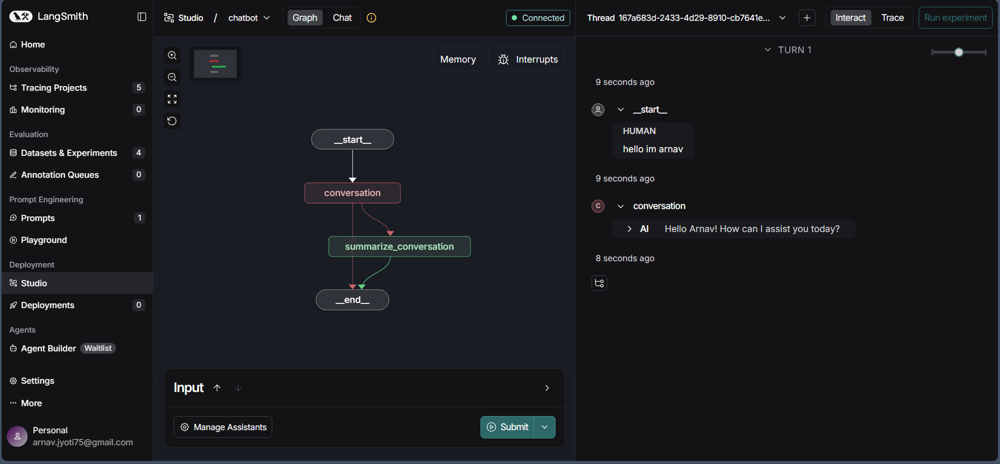

# Foundation: Introduction to LangGraph

---

## Module 0:

[arnavv06-langgraph-mat496/notebooks/module-0 at main · MAT496-Monsoon2025-SNU/arnavv06-langgraph-mat496](https://github.com/MAT496-Monsoon2025-SNU/arnavv06-langgraph-mat496/tree/main/notebooks/module-0)

There wasn't much to learn as everything had been covered before.

Set API keys and loaded the .env file. Also instantiated two models and used **.invoke()** and **.stream()** to pass HumanMessage as a string and get AIMessage as output.

*Changes made:*

Changed and added new prompts.

---

## Module 1: Introduction

[arnavv06-langgraph-mat496/notebooks/module-1 at main · MAT496-Monsoon2025-SNU/arnavv06-langgraph-mat496](https://github.com/MAT496-Monsoon2025-SNU/arnavv06-langgraph-mat496/tree/main/notebooks/module-1)

### Video 1: Motivation

Learned that **Chains** are fixed control flows set by the developer, and an A**gent** controls the flow defined by an LLM. As more control is given to the agent, the application's reliabilty decreases. **LangGraph** is used to increase this reliability.

*Changes made:*

There wasn't any code so no changes had to be made.

### Video 2: Simple Graph

[arnavv06-langgraph-mat496/notebooks/module-1/simple-graph.ipynb at main · MAT496-Monsoon2025-SNU/arnavv06-langgraph-mat496](https://github.com/MAT496-Monsoon2025-SNU/arnavv06-langgraph-mat496/blob/main/notebooks/module-1/simple-graph.ipynb)

Learned a very simple **graph** structure consisting of **nodes** and simple/conditional **branches**. Created one function to define "node" and one for "branch"

Learned how to create a graph using  **StateGraph()** which has a simple edge from Start to Node1, and **conditional edges** further ahead to decided which node to go to based on the parameters passed.

*Changes Made:*

* Created and added a couple of more **nodes** to the graph.
* Created more **conditional branches** and connected them in graph.
* Changed the branch function to decide which drink I like.

### Video 3: Langsmith Studio

Learned to visualise graphs as flowcharts using **Langsmith Studio**. Previosly it was being shown in jupyter notebook.

*Changes made:*

Edited **simple.py** file according to the graph I constructed in previous notebook.

### Video 4: Chain

[arnavv06-langgraph-mat496/notebooks/module-1/chain.ipynb at main · MAT496-Monsoon2025-SNU/arnavv06-langgraph-mat496](https://github.com/MAT496-Monsoon2025-SNU/arnavv06-langgraph-mat496/blob/main/notebooks/module-1/chain.ipynb)

Initially learned how to use messages as inputs to chat models, bind tools to them and get tool calls output.

I also learned how to implemented the same thing as a **chain** using a graph. A list of messages and a tool is first created, which are then put together in a graph as nodes and connected through edges. This comprises a chain.

*Changes made*:

* Changed messages to ask about some exercises.
* Created my own translational tool and replaced it in the code with the given one.

### Video 5: Router

[arnavv06-langgraph-mat496/notebooks/module-1/router.ipynb at main · MAT496-Monsoon2025-SNU/arnavv06-langgraph-mat496](https://github.com/MAT496-Monsoon2025-SNU/arnavv06-langgraph-mat496/blob/main/notebooks/module-1/router.ipynb)

Learnt how to make an LLM decide whether to invoke a **tools call** or not by interpreting the input. This works kind of like a **router**. A tool call is generated only if a question requiring that is asked, otherwise the LLM reponds by itself. Verified the same on Langsmith Studio.

*Changes made:*

* Edited code to include the **translational tool** created previosly.
* Edited **router.py** file to inlcude the translational tool
* Gave different inputs in **Langsmith Studio**

### Video 6: Agent

[arnavv06-langgraph-mat496/notebooks/module-1/agent.ipynb at main · MAT496-Monsoon2025-SNU/arnavv06-langgraph-mat496](https://github.com/MAT496-Monsoon2025-SNU/arnavv06-langgraph-mat496/blob/main/notebooks/module-1/agent.ipynb)

Created an **Agent** that can solve mathematical expressions. Previously the 'router node' either ended the program or gave a tools call, but now the tools call is given back to the router node(assistant) which might go back to the tools call and this process can go on in a loop until the model produces a fit answer. This is the intuition behind **React** architecture.

*Changes Made*:

* Added more mathematical functions to **convert_to_binary()** , **calculate_twos_complement()** , **add_twos_complement_binaries()**, **convert_from_twos_complement()**.
* Changed the **input** to include the added mathematical functions.

### Video 7: Agent with Memory

[arnavv06-langgraph-mat496/notebooks/module-1/agent-memory.ipynb at main · MAT496-Monsoon2025-SNU/arnavv06-langgraph-mat496](https://github.com/MAT496-Monsoon2025-SNU/arnavv06-langgraph-mat496/blob/main/notebooks/module-1/agent-memory.ipynb)

Learned how to add **Memory** to an Agent. It is done using **MemorySaver()** which can be used to set a **checkpoint**. The checkpoint preserves the state of the graph at a particular stage. A collection of such checkpoints is called thread. Using this, we can save the output from a previous call and use it as input for the next call.

In Langsmith Studio, this happens by default using a persistence layer which provides memory to agent.

*Changes Made:*

* Added all the tools i had made previously and ran the agent with **memory** on those tools.
* Edited the **agent.py** file to include the newly added tools.

---

## Module 2: State and Memory

[arnavv06-langgraph-mat496/notebooks/module-2 at main · MAT496-Monsoon2025-SNU/arnavv06-langgraph-mat496](https://github.com/MAT496-Monsoon2025-SNU/arnavv06-langgraph-mat496/tree/main/notebooks/module-2)

### Video 1: State Schema

[arnavv06-langgraph-mat496/notebooks/module-2/state-schema.ipynb at main · MAT496-Monsoon2025-SNU/arnavv06-langgraph-mat496](https://github.com/MAT496-Monsoon2025-SNU/arnavv06-langgraph-mat496/blob/main/notebooks/module-2/state-schema.ipynb)

Learned that the **schema**(structure and datatype used by graph) we established earlier using **TypeDict**, the type hints are not enforced at runtime and an invalid value could be assigned without raising an error. This happens with **DataClass** too which is also used to define structured data. Using **Pydantic** prevents this from happening and provides data validation.

*Changes made:*

* Changed and added graph nodes and branches functions built using TypeDict
* Changed and added graph nodes and branches functions built using DataClass
* Changed and added graph nodes and branches functions built using Pydantic

### Video 2: State Reducers

[arnavv06-langgraph-mat496/notebooks/module-2/state-reducers.ipynb at main · MAT496-Monsoon2025-SNU/arnavv06-langgraph-mat496](https://github.com/MAT496-Monsoon2025-SNU/arnavv06-langgraph-mat496/blob/main/notebooks/module-2/state-reducers.ipynb)

I learned that when we invoke a graph by inputting a value of they, the defualt behaviour is to **overwrite** the value. This causes an error when two nodes are run in **parallel** as they try to overwrite within the same step of the graph. **Reducers** solve this problem by rather than overwriting the value returned by a node, the add it along with the initial value to a **list**.

Also learned about **MessageState()** and different reducers provided by it.

*Changes made:*

* Changed the key from foo to **candy**, and its value from int to type **string**
* Modified the graph to show the use of reducers using string
* Changed **messages** to ask some geographical questions.

### Video 3: Multiple Schemas

[arnavv06-langgraph-mat496/notebooks/module-2/multiple-schemas.ipynb at main · MAT496-Monsoon2025-SNU/arnavv06-langgraph-mat496](https://github.com/MAT496-Monsoon2025-SNU/arnavv06-langgraph-mat496/blob/main/notebooks/module-2/multiple-schemas.ipynb)

Learned about **Overall** and **Private** state. Private state lets different nodes of the graph to share information with each other without affecting the input or final output. Also learned how to define custom **Input/Output schema** because StateSchema() by default expects nodes to communicate using a single schema only. Using I/O schema, we can filter out on what is allowed in the input and output of the graph.

*Changes made*:

* Added a couple of more intermediate nodes in the graph
* Changed how data is manipulated in return statements.

### Video 4: Trim and Filter Messages

[arnavv06-langgraph-mat496/notebooks/module-2/trim-filter-messages.ipynb at main · MAT496-Monsoon2025-SNU/arnavv06-langgraph-mat496](https://github.com/MAT496-Monsoon2025-SNU/arnavv06-langgraph-mat496/blob/main/notebooks/module-2/trim-filter-messages.ipynb)

Learned how to use **RemoveMessage** and **MessagesState()** to **filter, trim** and control the chat history with model. This helps in reducing **token usage**.                                      Observed in **Langsmith UI** that the LLM only takes in input the last message appended to messages list.

*Changes Made:*

* Changed the conversation and message list from ocean mammals to secrets of the **cosmos**.

### Video 5: Chatbot w/ Summarizing Messages and Memory

[arnavv06-langgraph-mat496/notebooks/module-2/chatbot-summarization.ipynb at main · MAT496-Monsoon2025-SNU/arnavv06-langgraph-mat496](https://github.com/MAT496-Monsoon2025-SNU/arnavv06-langgraph-mat496/blob/main/notebooks/module-2/chatbot-summarization.ipynb)

Learned how to build a chatmodel with memory that can **summarise** the conversation history with the user, which is a better way of preserving information compared to filtering and trimming. Set a **conditional edge** which decides when to produce a summary of the conversation.                                                                                     Verified in **Langsmith UI** that the most recent message passed was appended to a saved state, and summary was only produced when required.

*Changes Made:*

* Changed the conditions in conditional edge as to when to produce a summary.
* Changed the topic of the conversation to Quantum Physics

### Video 6: Chatbot w/ Summarizing Messages and External Memory

[arnavv06-langgraph-mat496/notebooks/module-2/chatbot-external-memory.ipynb at main · MAT496-Monsoon2025-SNU/arnavv06-langgraph-mat496](https://github.com/MAT496-Monsoon2025-SNU/arnavv06-langgraph-mat496/blob/main/notebooks/module-2/chatbot-external-memory.ipynb)

Upto now, the chatbot used an in memory checkpointer and lived throughout the lifetime of the notebook session. I learned how to use **SQlite**(a SQL DB) to implement and provide **external memory** to the chatbot. Observed that reloading the kernel retained the memory of the chatbot.

*Changes Made:*

* Changed the topic of the coversation to Newtonian Physics

---

## Module 3: UX and Human-in-the-Loop

[arnavv06-langgraph-mat496/notebooks/module-3 at main · MAT496-Monsoon2025-SNU/arnavv06-langgraph-mat496](https://github.com/MAT496-Monsoon2025-SNU/arnavv06-langgraph-mat496/tree/main/notebooks/module-3)

### Video 1: Streaming

[arnavv06-langgraph-mat496/notebooks/module-3/streaming-interruption.ipynb at main · MAT496-Monsoon2025-SNU/arnavv06-langgraph-mat496](https://github.com/MAT496-Monsoon2025-SNU/arnavv06-langgraph-mat496/blob/main/notebooks/module-3/streaming-interruption.ipynb)

Learned that LangGraph s**treaming** provides real-time updates as our graphs runs. Different sreaming ways are:

* **updates**: shows only the updates to the state after each node is called
* **values**: shows the full state after each node is called

Used **.astream_events** to stream tokens back from LLM. I also learned how to isolate and print the following keys of an event that come from a model:

* **event**: type of event being emitted.
* **name**: name of event.
* **data**: data associated with the event.
* **metadata**: has the node emitting the event(LangGraph_node)

*Changes Made:*

* Used **.astream_events** to stream tokens from **summarize_conversation** node also intead of just conversation node.
* Changed and added conversations topics of my own.

### Video 2: Breakpoints

[arnavv06-langgraph-mat496/notebooks/module-3/breakpoints.ipynb at main · MAT496-Monsoon2025-SNU/arnavv06-langgraph-mat496](https://github.com/MAT496-Monsoon2025-SNU/arnavv06-langgraph-mat496/blob/main/notebooks/module-3/breakpoints.ipynb)

In this video I learned that **breakpoints** are used to implement **Human-in-the-Loop** by stopping the execution of the graph at one point until a human provides an input.         Use cases for human-in-the-loop:

* **Approval:** approve steps by a human that an agent should take
* **Debugging:** rewind the graph to reproduce or avoid issues
* **Editing:** directly edit the state with human feedback

Also learned how to use **graph.stream()** to re-run the graph from a saved checkpoint.

*Changes Made:*

* Added a **breakpoin**t to pause the graph before **assistant** node is also called.
* Defined and added more **tools** to the tools list provided which was passed to the chatmodel
* Modified **agent.py** file to incorporate the changes made

### Video 3: Editing State and Human Feedback

[arnavv06-langgraph-mat496/notebooks/module-3/edit-state-human-feedback.ipynb at main · MAT496-Monsoon2025-SNU/arnavv06-langgraph-mat496](https://github.com/MAT496-Monsoon2025-SNU/arnavv06-langgraph-mat496/blob/main/notebooks/module-3/edit-state-human-feedback.ipynb)

Rather than just interrupting and awaiting user approval for the next node of graph, I learned to use breakpoints to **modify the state** of the graph. Played around in LangGraph UI to see how the workflow is implemented*.*

*Changes Made:*

* Added more tools to the tools list provided to the chat model
* Changed the arithmetic expressions and operations inputted to the graph

### Video 4: Dynamic Breakpoints
